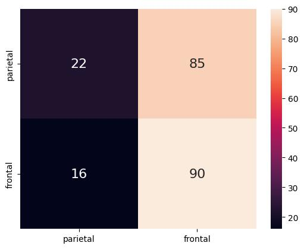

<h1 align="center">Rede Neural Binária (BNN) 🗃️: </h1>

<h2 align="center">Predição da região do experimento de ressonância magnética funcional (fMRI)</h2>

<strong>Autores:</strong> Maria Emily Nayla Gomes da Silva e Thomas Wolff Hannemann

<strong>Professor:</strong> Daniel R. Cassar

## 📝 Introdução

O trabalho apresenta a construção de uma <em>Rede Neural Binária</em> (BNN) com dados de fMRI, ressonância magnética funcional. Por meio da linguagem de programação Python, sem o uso de bibliotecas que treinam modelos de aprendizado de máquina, foi desenvolvido um modelo de rede neural capaz de realizar uma classificação binária para predizer a região cerebral onde ocorreu o experimento de neuroimagem como "parietal" ou "frontal". Dessa forma, nosso trabalho consistiu em modificar uma Rede Neural de regressão — algoritmo disponibilizado pelo Prof. Dr. Daniel Cassar — para um modelo de classificação binária. Para isso, alteramos a função de perda <em>Sum of Squared Errors (SSE)</em>, para <em>cross entropy</em> e adicionamos à classe Valor o método de logaritmo natural. Além disso, foram realizadas análises de dados específicas para o modelo de classificação binária.

## 🗂️ Dataset seaborn fMRI

O dataset utilizado para conseguir treinar a BNN foi o <strong>fmri</strong>, um dataset didático da biblioteca Seaborn.1 Os dados contidos nele são sobre um experimento de neuroimagem funcional (<strong>fMRI</strong>), e cada coluna nos indica:

### Tabela de Features do Dataset `fmri`

| Features    | Descrição                                                                                                                                             |
|-------------|--------------------------------------------------------------------------------------------------------------------------------------------------------|
| `subject`   | Código identificador do participante.                                                                                                                 |
| `timepoint` | Ponto no tempo em que a medição foi realizada – medida por TR (*repetition time*), que é o intervalo entre duas aquisições consecutivas de imagens do cérebro. |
| `event`     | Tipo de estímulo que o participante recebeu.                                                                                                          |
| `region`    | Região cerebral onde a medição foi feita.                                                                                                             |
| `signal`    | Valor do sinal fMRI medido na região – a atividade cerebral registrada.                                                                               |

Com esses dados disponíveis, foram utilizadas como <em>features</em> as variáveis <em>timepoint</em>, <em>signal</em> e <em>event</em>; e como <em>target</em>, a variável <em>region</em>. Ou seja, a proposta é identificar se a medição foi realizada na região parietal ou frontal do cérebro.

## 🏋️‍♀️ Construindo e Treinando a BNN

Para modificar uma rede neural <strong>regressora</strong> para uma <strong>classificadora binária</strong> em Python puro, foi necessário realizar algumas alterações no código disponível, como incluindo métodos e mudando a avaliação de performance do modelo.

### -> Adicionando log 

 O notebook não apresentava o método de logaritmo natural na função <strong>Valor</strong>. Contudo, para conseguir realizar as operações da função de perda, seria necessário realizar essa operação e, por isso, a implementamos.

### -> Binary Cross Entropy Loss

Essa é uma função de perda bastante utilizada para problemas de classificação binária. Considerando um conjunto de N exemplos, a perda é calculada da seguinte forma:

$$
\text{Loss} = -\frac{1}{N} \sum_{i=1}^{N} \left[ y_i \log(p_i) + (1 - y_i) \log(1 - p_i) \right]
$$

Em que $y_i$ representa o valor real do exemplo <em>i</em> e $p_i$ é a probabilidade predita para esse exemplo, sendo um número entre 0 e 1.4

### -> Acurácia

Essa foi a métrica escolhida para avaliar o desempenho da rede neural de classificação. A acurácia indica a razão de previsões corretas em relação ao total de amostras disponíveis no conjunto de dados. Ou seja:

$$
\mathrm{ACC = \frac{VP + VN}{VP + FP + VN + FN}}
$$

Sendo $VP$ o verdadeiro positivo, $FP$ o falso positivo, $VN$ o verdadeiro negativo e $FN$ o falso negativo. Nesse sentido, a acurácia é uma métrica que varia entre 0 e 1 e, quanto maior esse valor, melhor o desempenho do modelo.

## 🔢 Resultados Obtidos

Os resultados obtidos foram abaixo do esperado. Como foi criada uma rede neural com quatro camadas ocultas e o dataset é didático, esperava-se um desempenho melhor. No entanto, por ter sido implementado em Python puro, o código não é otimizado, o que ajuda a explicar os resultados pouco melhores aos de um modelo de baseline. Ainda assim, o que foi construído é bastante didático e contribui para a compreensão de todos os passos realizados por uma <em>Rede Neural Binária</em> até alcançar o <em>target</em>. A acurácia do modelo atingiu 55.87%, e a matriz de confusão a seguir evidencia que o modelo não apresentou boa sensibilidade aos dados, pois os resultados preditos são semelhantes ao baseline.

  

## 😁 Conclusão

O notebook é bastante relevante para compreender como funciona uma <em>Rede Neural Binária</em> em Python puro, assim como para entender como é possível avaliar a performance desse tipo de modelo. Contudo, <strong>não</strong> é um código otimizado para gerar resultados relevantes em problemas de classificação binária. Além disso, todos os debates contidos neste README podem ser lidos de maneira mais detalhada no notebook disponível.

## 👩‍🦳 Referências
$1$ [**GitHub - mwaskom/seaborn-data: Data repository for seaborn examples**](https://github.com/mwaskom/seaborn-data)  
Acesso em 6 de abril de 2025.

$2$ [**“Adaptive Engagement of Cognitive Control in Context-Dependent Decision Making | Cerebral Cortex | Oxford Academic”**](https://academic.oup.com/cercor/article/27/2/1270/3056315?keytype=ref&ijkey=5hjFprzQ7miiYZ4)  
Acesso em 6 de abril de 2025.

$3$ [**“Classification of Neural Network in TensorFlow | GeeksforGeeks”**](https://www.geeksforgeeks.org/classification-of-neural-network-in-tensorflow/)  
Acesso em 6 de abril de 2025.

$4$ [**GeeksforGeeks. “What Is Cross-Entropy Loss Function?”**](https://www.geeksforgeeks.org/what-is-cross-entropy-loss-function/)  
Acesso em 6 de abril de 2025.

$5$ [**Kuriakose, Jeril. “A Simple Neural Network Classifier Using PyTorch, from Scratch”. Analytics Vidhya (blog)**](https://medium.com/analytics-vidhya/a-simple-neural-network-classifier-using-pytorch-from-scratch-7ebb477422d2)  
Acesso em 6 de abril de 2025.

## 🧠 Contribuições dos Colaboradores
| [  Maria Emily Nayla](https://github.com/MEmilyGomes)  [Currículo Lattes](http://lattes.cnpq.br/9482558334105708)  |  [ Thomas Wolff Hannemann](https://github.com/ThomasHannemann)    | 
| :---: | :---: | 

#### Para o Projeto:
* Emily Gomes: Atualizando, treinando e analisando dados da previsão de uma BNN utilizando Python puro.
* Thomas Wolff: Atualizando, treinando e analisando dados da previsão de uma BNN utilizando Python puro. 

#### Para o Repositório GitHub:
* Emily Gomes: README, upload de imagens.
* Thomas Wolff: Upload do notebook Jupyter referente a construção, treinamento e previsão da BNN.
  
