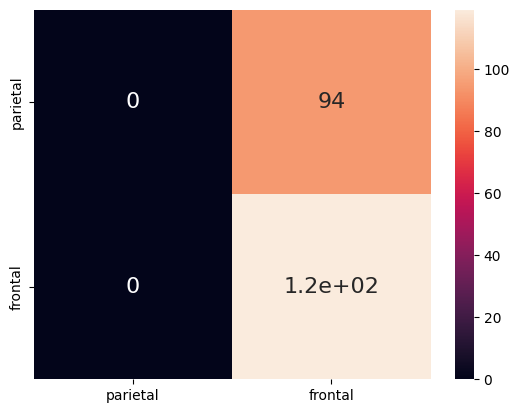

<h1 align="center">Rede Neural Binária (BNN) 🗃️: </h1>

<h2 align="center">Predição da região do experimento de ressonância magnética funcional (fMRI)</h2>

<strong>Autores:</strong> Maria Emily Nayla Gomes da Silva e Thomas Wolff Hannemann

<strong>Professor:</strong> Daniel R. Cassar

## 📝 Introdução

 Neste caderno 

## 🗂️ Dataset seaborn fMRI

## 🏋️‍♀️ Construindo e Treinando a BNN

## 🔢 Resultados Obtidos

  

## 😁 Conclusão

## 🧠 Contribuições dos Colaboradores
| [  Maria Emily Nayla](https://github.com/MEmilyGomes)  [Currículo Lattes](http://lattes.cnpq.br/9482558334105708)  |  [ Thomas Wolff Hannemann](https://github.com/ThomasHannemann)    | 
| :---: | :---: | 

#### Para o Projeto:
* Emily Gomes: Atualizando, treinando e analisando dados da previsão de uma BNN utilizando Python puro.
* Thomas Wolff: Atualizando, treinando e analisando dados da previsão de uma BNN utilizando Python puro. 

#### Para o Repositório GitHub:
* Emily Gomes: README, upload de imagens.
* Thomas Wolff: Upload do notebook Jupyter referente a construção, treinamento e previsão da BNN.
  
